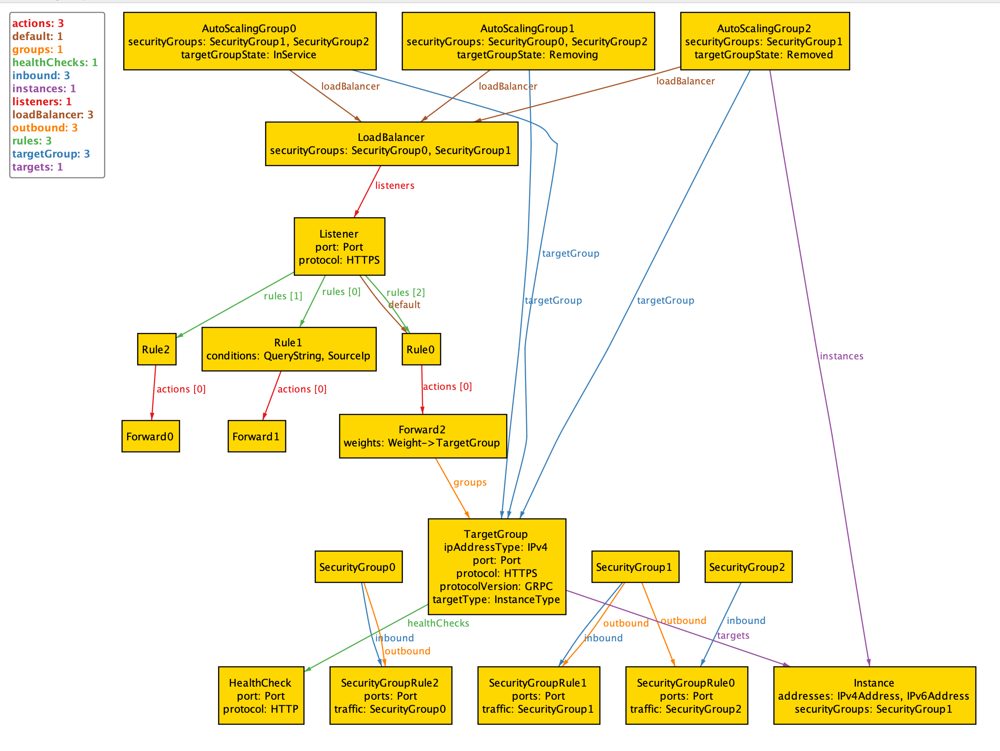

---
---

# Modeling AWS Application Load Balancers in Alloy



I've always found the configuration details for AWS [application load balancers][alb-intro] (ALBs) confusing.

To configure an ALB, you need to understand multiple concepts, including:
* listeners
* rules
* actions
* target groups

You also need to understand *security groups*, otherwise your ALB won't actually be able to serve traffic.
And, if you use *autoscaling groups*, you'll need to understand how those relate to ALBs.

The large number of moving parts makes ALBs an excellent candidate for modeling in [Alloy][alloy-docs], which is what this repo contains.
I've annotated my model with comments that are copy-pasted from the [ALB docs][alb-intro].

Note that you can load this Markdown file directly in the [Alloy Analyzer][analyzer].
I've also saved the theme file that I've used (it's called [theme.thm](theme.thm)) for the visualization.

[analyzer]: https://alloytools.org/download.html

## Basics

Here are some common models we're going to need.
Note that Alloy doesn't require us to specify them before they are used, but I decided to put them up front.
Most of these should be self-explanatory.


```alloy
// In the actual AWS API, duration is an integer that represents the duration in seconds
// But we don't need to model it at that level of detail here
sig Duration {}


abstract sig Protocol {}
one sig HTTP, HTTPS extends Protocol {}

sig Port {}

abstract sig IpAddressType {}
one sig IPv4, IPv6 extends IpAddressType {}


// Note that we only explicitly model the 301 and 302 codes.
sig StatusCode {}
one sig HTTP_301, HTTP_302 extends StatusCode {}

sig ContentType {}
sig HostName {}
sig Path {}
sig Query {}
```

## Security group

Before we dive in to ALBs, we're going to model security groups.

<https://docs.aws.amazon.com/vpc/latest/userguide/VPC_SecurityGroups.html>

```alloy

sig SecurityGroup {
  inbound: set SecurityGroupRule,
  outbound: set SecurityGroupRule
}

sig SecurityGroupRule {
  protocol: SecurityGroupProtocol,
  ports: some Port,
  // source for inbound, dest for outbound
  // We aren't modeling prefix lists here
  traffic: IPv4Address+IPv6Address+IPv4Range+IPv6Range+SecurityGroup
}

abstract sig IpAddress {}
sig IPv4Address, IPv6Address extends IpAddress {}

abstract sig IpRange {
  addresses: set IpAddress
}
sig IPv4Range extends IpRange {} {
  addresses in IPv4Address
}
sig IPv6Range extends IpRange {} {
  addresses in IPv6Address
}


sig SecurityGroupProtocol {}
// There are other protocols, but here we're only modeling TCP
one sig TCP extends SecurityGroupProtocol {}
```

We also create a convenience function to check for access between AWS entities.
We assume both source and destination entities are associated with a collection of security groups.

```alloy
// True if src is allowed to reach dest on port
pred allows[source : set SecurityGroup, dest : set SecurityGroup, port: Port] {
  // inbound access allowed to dest from source
  some rule : dest.inbound | {
    // allows access on the port
    port in rule.ports

    // from the "source" security group
    some source & rule.traffic
  }

  // outbound access allowed to dest from source
  some rule : source.outbound {
    // allows access on the port
    port in rule.ports
    some dest & rule.traffic
  }
}
```


## Load balancer

Here's where we actually start to model the load balancer.

```alloy
// A load balancer serves as the single point of contact for clients
sig LoadBalancer {
  //  You add one or more listeners to your load balancer.
  listeners: set Listener,

  securityGroups: set SecurityGroup,
} {
  // The docs don't specify this, but presumably the listeners have to be on different ports
  no disj l1, l2: listeners | l1.port=l2.port

  // The rules for the security groups that are associated with your load balancer
  // must allow traffic in both directions on both the listener and the health check ports.

  // Allow inbound access to the listener
  all l: Listener | some s : securityGroups | {
    l.port in s.inbound.ports
  }

  //
  // Allow the load balancer to hit the instances on their listener ports and health check ports
  //

  // All target groups (other than lambdas, which don't have security groups)
  let grps = listeners.rules.elems.actions.elems.groups |  {
    all targetGroup : grps |  {
      // Each security group of the targets in the group must allow inbound access on the target group port
      all target : targetGroup.targets | {
        allows[securityGroups, target.@securityGroups, targetGroup.port]
        all healthCheck : targetGroup.healthChecks |
          allows[securityGroups, target.@securityGroups, healthCheck.port]
      }
    }
  }
}


// A listener checks for connection requests from clients, using the protocol and port that
// you configure.
sig Listener {
  // A listener is configured for a specific protocol and port
  protocol: Protocol,
  port: Port,

  // The rules that you define for a listener determine how the load balancer routes requests
  // to its registered targets.
  // They are sorted in priority order
  rules: seq Rule,
  // You must define a default rule for each listener
  default: Rule

} {
  // Rules are unique. Even if two rules have the same values,
  // they're still different rules according to Alloy
  not rules.hasDups


  // The default rule is evaluated last.
  default in rules.last

  // the default rule cannot have any conditions
  // https://docs.aws.amazon.com/elasticloadbalancing/latest/application/listener-update-rules.html
  no default.conditions
}

```

## Rules

[Listener rule docs][listener-rules]


```alloy

//  Each rule consists of a priority, one or more actions, and one or more conditions.
//  We model the priority as a sequence on the listener, rather than in the Rule sig
sig Rule {
  actions: seq Action,

  // conditions that need to match for the rule to fire
  // not sure if any or all conditions have to match
  conditions: set Condition
} {
  // Each rule must include exactly one of the following actions: forward, redirect, or fixed-response
  // and it must be the last action to be performed.
  some s : actions.elems | {
    s in Forward+Redirect+FixedResponse // one of those actions
    no (actions.elems - s ) & Forward+Redirect+FixedResponse // it's the only one
    s in actions.last // it's the last action
    // it's not in the other acitons
    no s & actions.butlast.elems


  }

  // Each rule can optionally include up to one of each of the following conditions: host-header, http-request-method, path-pattern, and source-ip.
  lone conditions & (HostHeader+HttpRequestMethod+PathPattern+SourceIp)

  // Each rule can also optionally include one or more of each of the following conditions: http-header and query-string.
  // Alloy permits this by default, so nothing to specify here

}

fact "All rules are associated with a listener" {
  all r : Rule | some l: Listener | r in l.rules.elems
}


sig Priority {}
```

## Actions

<https://docs.aws.amazon.com/elasticloadbalancing/latest/application/load-balancer-listeners.html#rule-action-types>

```alloy
abstract sig Action {}

// We don't model these in detail, for more details, see:
// https://docs.aws.amazon.com/elasticloadbalancing/latest/APIReference/API_AuthenticateCognitoActionConfig.html
// https://docs.aws.amazon.com/elasticloadbalancing/latest/APIReference/API_AuthenticateOidcActionConfig.html
lone sig AuthenticateCognito, AuthenticateOidc extends Action {}

fact "authenticate actions require https listener" {
  all l : Listener |
    some l.rules.elems.actions.elems & (AuthenticateCognito+AuthenticateOidc) => l.protocol = HTTPS
}
```


### Fixed response

<https://docs.aws.amazon.com/elasticloadbalancing/latest/application/load-balancer-listeners.html#fixed-response-actions>

```alloy
sig FixedResponse extends Action {
  statusCode: StatusCode,
  contentType: ContentType,
  messageBody: MessageBody
}

sig MessageBody {}
```

### Forward actions

<https://docs.aws.amazon.com/elasticloadbalancing/latest/application/load-balancer-listeners.html#forward-actions>

```alloy

//
sig Forward extends Action {
  groups: set TargetGroup,
  weights: Weight->groups,

  // sticky sessions are optionally configured.
  // If enabled, specify a duration
  // For more details on stickiness, see: https://docs.aws.amazon.com/elasticloadbalancing/latest/application/sticky-sessions.html
  stickiness: lone Duration
} {
  // All groups get some weight
  all group : groups | some weights.group
}

//  Each target group weight is a value from 0 to 999
// We don't model the weights explicitly here.
sig Weight {}

```

### Redirect actions

<https://docs.aws.amazon.com/elasticloadbalancing/latest/application/load-balancer-listeners.html#redirect-actions>

```alloy
//
// Redirect target: protocol://hostname:port/path?query
sig Redirect extends Action {
  statusCode: HTTP_301+HTTP_302,
  protocol: Protocol,
  hostname: HostName,
  port: Port,
  path: Path,
  query: Query
}
```

## Conditions

<https://docs.aws.amazon.com/elasticloadbalancing/latest/application/load-balancer-listeners.html#rule-condition-types>

```alloy

// // You can specify up to three match evaluations per condition, but we don't model that explicitly here
abstract sig Condition {}

// https://docs.aws.amazon.com/elasticloadbalancing/latest/application/load-balancer-listeners.html#host-conditions
// Route based on the host name of each request
sig HostHeader extends Condition {}

// https://docs.aws.amazon.com/elasticloadbalancing/latest/application/load-balancer-listeners.html#http-header-conditions
// Route based on the HTTP headers for each request
sig HttpHeader extends Condition {}

// https://docs.aws.amazon.com/elasticloadbalancing/latest/application/load-balancer-listeners.html#http-request-method-conditions
// Route based on the HTTP request method of each request
sig HttpRequestMethod extends Condition {}

// Route based on path patterns in the request URLs.
// https://docs.aws.amazon.com/elasticloadbalancing/latest/application/load-balancer-listeners.html#path-conditions
sig PathPattern extends Condition {}

// Route based on path patterns in the request URLs.
// https://docs.aws.amazon.com/elasticloadbalancing/latest/application/load-balancer-listeners.html#query-string-conditions
sig QueryString extends Condition {}

// Route based on the source IP address of each request
// https://docs.aws.amazon.com/elasticloadbalancing/latest/application/load-balancer-listeners.html#source-ip-conditions
sig SourceIp extends Condition {}

```

# Target groups

<https://docs.aws.amazon.com/elasticloadbalancing/latest/application/load-balancer-target-groups.html>

```alloy

// Each target group routes requests to one or more registered targets, such as EC2 instances, using the protocol and port number that you specify.
sig TargetGroup {
  protocol: Protocol,
  port: Port,

  targetType: TargetType,
  ipAddressType: IpAddressType,


  targets: set Target,
  // You can configure health checks on a per target group basis.
  healthChecks: set HealthCheck,

  protocolVersion: ProtocolVersion
} {
  // Targets have to match the type
  (targetType in InstanceType) => targets in Instance
  (targetType in IpType) => targets in IP
  (targetType in LambdaType) => {
    targets in Lambda
    // For lambdas, only one target
    one targets
  }

  // Considerations for the gRPC protocol version
  (protocolVersion = GRPC) => {
    // The only supported listener protocol is HTTPS.
    protocol = HTTPS
    // The only supported action type for listener rules is forward.
    // The model already enforces this, because you can only specify a target group with a forward rule

    // The only supported target types are instance and ip.
    targetType in InstanceType+IpType

    // You cannot use Lambda functions as targets.
    // This sounds redundant with the one above
  }

  // Considerations for the HTTP/2 protocol version
  (protocolVersion = HTTP2) => {
    // The only supported listener protocol is HTTPS.
    protocol = HTTPS
    // The only supported action type for listener rules is forward.
    // The model already enforces this, because you can only specify a target group with a forward rule

    // The only supported target types are instance and ip.
    targetType in InstanceType+IpType
  }


}

abstract sig TargetType {}

// The targets are specified by instance ID.
one sig InstanceType extends TargetType {}

// The targets are IP addresses
// For restrictions by CIDR block, see: https://docs.aws.amazon.com/elasticloadbalancing/latest/application/load-balancer-target-groups.html#target-type
one sig IpType extends TargetType {}

// The target is a Lambda function.
one sig LambdaType extends TargetType {}

// https://docs.aws.amazon.com/elasticloadbalancing/latest/application/load-balancer-target-groups.html#target-group-protocol-version
abstract sig ProtocolVersion {}
one sig HTTP1_1, HTTP2, GRPC extends ProtocolVersion {}

```

## Targets

<https://docs.aws.amazon.com/elasticloadbalancing/latest/application/target-group-register-targets.html>


```alloy
abstract sig Target {}
abstract sig SecurityGroupTarget extends Target {
  securityGroups: set SecurityGroup
}

sig IP extends SecurityGroupTarget {
  // An IP is associated with a single IP address
  address: IpAddress
}

fact "addresses are unique" {
  no disj ip1, ip2 : IP | ip1.address = ip2.address
}


sig Instance extends SecurityGroupTarget {
  // An instance can have multiple IP addresses, must have at least one
  addresses: some IpAddress
}

fact "all addresses are associated with at most one instance" {
  all addr : IpAddress | lone (Instance <: addresses).addr
}


// Lambdas don't use security groups for access permissions, they use a different mechanism, see:
// https://docs.aws.amazon.com/lambda/latest/dg/services-alb.html
sig Lambda extends Target {}
```


## Health checks

<https://docs.aws.amazon.com/elasticloadbalancing/latest/application/target-group-health-checks.html>


```alloy
// Health checks are performed on all targets registered to a target group that is specified in a listener rule for your load balancer.

sig HealthCheck {
  protocol: Protocol,
  port: Port,

  // Confusingly, a "path" in the redirect actions is separate from the query: https://docs.aws.amazon.com/elasticloadbalancing/latest/application/load-balancer-listeners.html#redirect-actions
  // Here, the path includes the query, so we use a different model
  path: HealthCheckPath,
  timeout: Duration,
  interval: Duration,
  healthyThreshold: Count,
  unhealthyThreshold: Count,
  // The codes to use when checking for a successful response from a target. These are called Success codes in the console.
  matcher: set StatusCode
}

sig HealthCheckPath {
  path: Path,
  query: lone Query
}

// Model of an integer count
sig Count {}
```

## Autoscaling groups

Interestingly, you don't add an autoscaling group to a load balancer.
Instead, you add a load balancer to an autoscaling group.
Presumably, the ASG service is responsible for adding and removing targets to/from the load balancer's target group.

```alloy
sig AutoScalingGroup {
  instances: set Instance,
  securityGroups: set SecurityGroup,
  loadBalancer: lone LoadBalancer,
  targetGroup: lone TargetGroup,
  targetGroupState : TargetGroupState

} {
  // All of the instances have the same security group configuration
  all i : instances | securityGroups = i.@securityGroups

  // if the ASG is associated with a load balancer, it is associated with a target group
  some loadBalancer => some targetGroup
}

fact "instance can be in at most one ASG" {
  all disj i1, i2 : Instance | no (instances.i1 & instances.i2)
}

// https://docs.aws.amazon.com/autoscaling/ec2/APIReference/API_LoadBalancerTargetGroupState.html
abstract sig TargetGroupState {}
one sig Adding, Added, InService, Removing, Removed extends TargetGroupState {}
```


## Running the model


```alloy
fact "no unowned entities of interest" {
  all l: Listener | some listeners.l
  all t: TargetGroup | some f : Forward | t in f.groups
  all action : Action | some rule : Rule | action in rule.actions.elems
  all h : HealthCheck | some t: TargetGroup  | h in t.healthChecks

  all asg : AutoScalingGroup | some asg.loadBalancer
}

// We'll focus specifically on security-group related security group rules in our outputs
fact "Only security group based security group rules" {
  SecurityGroupRule.traffic in SecurityGroup

  // We just won't generate any of the IP related stuff
  no IP
  no IpRange
}

fact "all instances are owned by ASGs" {
  Instance in AutoScalingGroup.instances
}


run {
  one LoadBalancer
  some AutoScalingGroup.instances
  some LoadBalancer.listeners
  all t : TargetGroup | some t.targets

  // No auth for now, to keep things simple
  no AuthenticateCognito
  no AuthenticateOidc
}
```


[alb-intro]: https://docs.aws.amazon.com/elasticloadbalancing/latest/application/introduction.html
[alloy-docs]: https://alloy.readthedocs.io/en/latest/
[listener-rules]: https://docs.aws.amazon.com/elasticloadbalancing/latest/application/load-balancer-listeners.html#listener-rules
